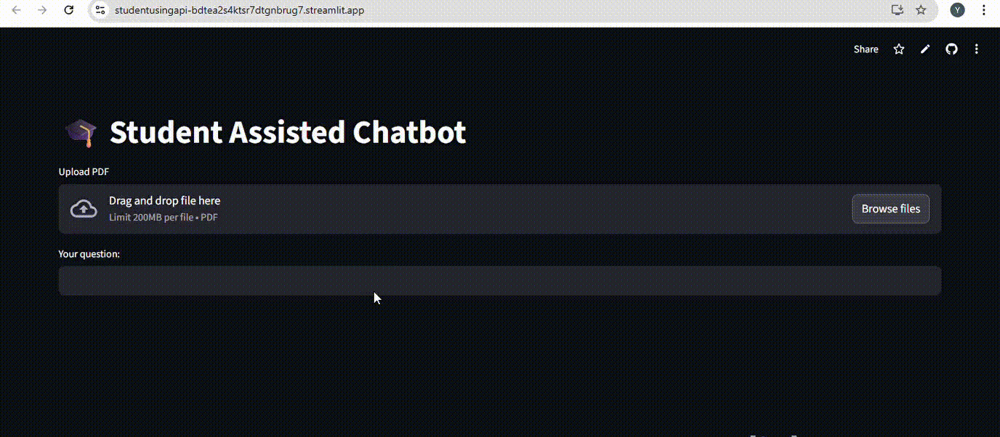
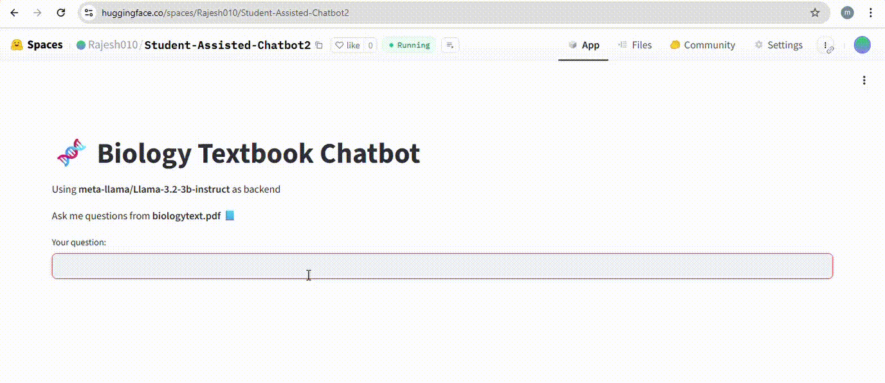

# 🤖 DoqTalk – RAG Chatbots Collection  

Welcome to **DoqTalk**, a collection of four Retrieval-Augmented Generation (RAG) chatbot projects.  
Each chatbot demonstrates a different flavor of RAG, showcasing how retrieval and generation can be combined to build smarter AI assistants.  

All chatbots are available with **Hugging Face Spaces** and **Streamlit Cloud** deployments, so you can try them instantly.  

---

## 📌 Overview of Chatbots  

| Chatbot | RAG Type | Folder | Hugging Face | Streamlit |
|---------|----------|--------|--------------|------------|
| **General_RAG** | Standard RAG with vector DB retrieval | [General_RAG](./General_Rag) | [🔗 Live](#https://huggingface.co/spaces/Rajesh010/Student-Assisted-Chatbot2) | [🔗 Live](#) |
| **Self_RAG** | Self-consistency RAG (re-ranks multiple answers) | [Self RAG](./Self_Rag) | [🔗 Live](#) | [🔗 Live](#) |
| **Hyde_RAG** | Hypothetical Document Embedding (HyDE) | [HyDE RAG](./HyDE_Rag) | [🔗 Live](#) | [🔗 Live](#) |
| **Hyqe_RAG** | Hybrid Query Expansion RAG | [Fusion RAG](./Fusion_Rag) | [🔗 Live](#) | [🔗 Live](#) |
 

---

## 🎥 Demos  

Here are quick walkthroughs showing the chatbots running live on both platforms:  

### 🚀 Streamlit Cloud Demo  
  

---

### 🤗 Hugging Face Spaces Demo  
  


---

## 📂 Project Structure  

(Example tree, keep updated with your repo)  


---

## 🖥️ Run Locally  

Clone the repo and navigate into a chatbot folder, for example `General_RAG`:  

```bash
# Clone repository
git clone https://github.com/your-username/DoqTalk.git
cd DoqTalk/General_RAG

# Install dependencies
pip install -r requirements.txt

# Run Streamlit app
streamlit run app.py
```
## 📜 License  

This project is licensed under the **MIT License** – see the [LICENSE](./LICENSE) file for details.  

## 🚀 Deployment Guide  

### 1️⃣ Hugging Face Spaces  
- Go to **[Hugging Face Spaces](https://huggingface.co/spaces)**  
- Create a **New Space** → choose **Streamlit SDK**  
- Upload or push your chatbot folder code (`app.py`, `requirements.txt`)  
- Hugging Face will auto-install dependencies  
- Your app will run with:  
  ```bash
  streamlit run app.py
  ```
### 2️⃣ Streamlit Cloud  
- Sign in at **[Streamlit Cloud](https://streamlit.io/cloud)**  
- Create a **New App**  
- Connect your GitHub repo and select the chatbot folder (`app.py`)  
- Add your dependencies from `requirements.txt`  
- Deploy the app — Streamlit will build and serve it automatically  
- 🔗 The deployed app link will appear in your Streamlit dashboard 

## 🛠️ Tech Stack  

- **Python 3.9+** – Core programming language  
- **Streamlit** – Interactive web UI framework  
- **Hugging Face Transformers** – Pre-trained models for retrieval & generation  
- **RAG Architecture** – Retriever + Generator pipeline for intelligent responses  
- **Deployment** – Hosted on Hugging Face Spaces & Streamlit Cloud
  ## 📜 License  

This project is licensed under the **MIT License** – see the [LICENSE](./LICENSE) file for details.  

